# Life Capital — Database Design & ERD

> Tài liệu mô tả cấu trúc cơ sở dữ liệu PostgreSQL chi tiết, thực thể liên kết (ERD) và các chỉ mục (indexes) tối ưu hiệu năng.

---

## 1. Entity Relationship Diagram (ERD)

```mermaid
erDiagram
    users ||--o{ investor_profiles : evolves
    users ||--o{ life_events : experiences
    users ||--o{ dependents : supports
    users ||--o{ income_streams : earns
    users ||--o{ assets : owns
    users ||--o{ portfolio_holdings : holds
    users ||--o{ investment_policies : defines
    users ||--o{ investment_theses : writes
    users ||--o{ earnings_reviews : reviews
    users ||--o{ decision_journal : logs
    users ||--o{ monthly_reviews : conducts
    users ||--o{ watchlist : watches
    users ||--o{ fi_snapshots : tracks
    users ||--o{ net_worth_snapshots : snapshots
    users ||--o{ financial_goals : sets
    users ||--o{ liabilities : owes
    users ||--o{ ai_conversations : chats
    liabilities ||--o{ liability_snapshots : logs

    life_events ||--o| investor_profiles : triggers
    life_events ||--o| investment_policies : triggers
    life_events ||--o| financial_goals : creates
    investor_profiles ||--o{ investment_policies : informs
    investment_policies ||--o{ ips_target_allocations : specifies
    investment_theses ||--o{ thesis_versions : versions
    investment_theses ||--o{ decision_journal : motivates
    investment_theses ||--o{ watchlist : links

    users {
        uuid id PK
        string email
        string name
        string password_hash "Nullable for Google Auth"
        string auth_provider "local or google"
        string google_id "Nullable, Unique"
    }

    investor_profiles {
        uuid id PK
        uuid user_id FK
        int version
        string status
        date date_of_birth
        string marital_status
        string risk_tolerance
        int risk_score
        decimal total_monthly_income
        decimal total_monthly_expense
        decimal fi_target_amount
        jsonb life_constraints
        text ai_profile_summary
    }

    life_events {
        uuid id PK
        uuid user_id FK
        date event_date
        enum category
        string title
        decimal income_impact
        decimal expense_impact
        text ai_impact_analysis
        int triggered_profile_version
        int triggered_ips_version
        boolean requires_ips_update
    }

    dependents {
        uuid id PK
        uuid user_id FK
        string name
        string relationship
        date date_of_birth
        decimal monthly_cost
        boolean is_active
    }

    income_streams {
        uuid id PK
        uuid user_id FK
        string name
        string type
        boolean is_passive
        decimal amount
        boolean is_active
    }

    assets {
        uuid id PK
        uuid user_id FK
        enum category
        string name
        string ticker
        decimal quantity
        decimal current_value
    }

    liabilities {
        uuid id PK
        uuid user_id FK
        enum category
        string name
        decimal remaining_balance
        decimal interest_rate
        decimal monthly_payment
        string lender
    }

    liability_snapshots {
        uuid id PK
        uuid user_id FK
        uuid liability_id FK
        date snapshot_date
        decimal remaining_balance
    }

    portfolio_holdings {
        uuid id PK
        uuid user_id FK
        string ticker
        decimal current_allocation
        decimal target_allocation
        int conviction_score
        string recommendation
    }

    investment_policies {
        uuid id PK
        uuid user_id FK
        int version
        int profile_version
        uuid trigger_event_id FK
        jsonb target_allocation
        jsonb buy_rules
        jsonb sell_rules
        text ai_rationale
    }

    investment_theses {
        uuid id PK
        uuid user_id FK
        string ticker
        text why_i_own
        jsonb moat
        jsonb catalysts
        jsonb risks
        jsonb sell_conditions
        int conviction_score
    }

    earnings_reviews {
        uuid id PK
        uuid user_id FK
        string ticker
        int fiscal_year
        int fiscal_quarter
        decimal revenue
        decimal net_profit
        decimal roe
        int ai_score
    }

    decision_journal {
        uuid id PK
        uuid user_id FK
        date decision_date
        enum decision_type
        string ticker
        decimal amount
        jsonb reasons
        uuid life_event_id FK
    }

    monthly_reviews {
        uuid id PK
        uuid user_id FK
        date review_month
        int profile_version_at_review
        int ips_version_at_review
        decimal new_investment_amount
        jsonb ai_recommendations
        text ai_overall_summary
        text ai_life_context_analysis
    }

    watchlist {
        uuid id PK
        uuid user_id FK
        string ticker
        string status
        int quality_score
    }

    fi_snapshots {
        uuid id PK
        uuid user_id FK
        decimal fi_number
        decimal fi_progress_pct
        decimal savings_rate
        decimal estimated_years_to_fi
        int profile_version
    }

    financial_goals {
        uuid id PK
        uuid user_id FK
        string title
        decimal target_amount
        decimal current_amount
        int priority
        string category
        string status
        uuid linked_life_event_id FK
    }
```



---

## 2. Table Schemas (PostgreSQL)

```sql
-- =============================================
-- USER & SESSIONS
-- =============================================

CREATE TABLE users (
    id              UUID PRIMARY KEY DEFAULT gen_random_uuid(),
    email           VARCHAR(255) UNIQUE NOT NULL,
    name            VARCHAR(255) NOT NULL,
    password_hash   VARCHAR(255) NOT NULL,
    created_at      TIMESTAMPTZ DEFAULT NOW(),
    updated_at      TIMESTAMPTZ DEFAULT NOW()
);

-- =============================================
-- INVESTOR PROFILE & LIFE TIMELINE (Module 0)
-- =============================================

CREATE TABLE investor_profiles (
    id              UUID PRIMARY KEY DEFAULT gen_random_uuid(),
    user_id         UUID REFERENCES users(id) ON DELETE CASCADE,
    version         INTEGER NOT NULL DEFAULT 1,
    status          VARCHAR(20) DEFAULT 'active',

    date_of_birth       DATE,
    gender              VARCHAR(20),
    marital_status      VARCHAR(20),
    occupation          VARCHAR(255),
    employer            VARCHAR(255),

    primary_income          DECIMAL(18,2),
    secondary_income        DECIMAL(18,2),
    total_monthly_income    DECIMAL(18,2),
    total_monthly_expense   DECIMAL(18,2),
    monthly_savings         DECIMAL(18,2),
    monthly_investment      DECIMAL(18,2),

    fi_target_amount        DECIMAL(18,2),
    fi_target_date          DATE,
    annual_withdrawal_rate  DECIMAL(5,4),
    emergency_fund_target   DECIMAL(18,2),

    risk_tolerance          VARCHAR(20),
    risk_score              INTEGER CHECK (risk_score BETWEEN 1 AND 10),
    investment_horizon      INTEGER,
    investment_style        TEXT,
    investment_philosophy   TEXT,

    life_constraints        JSONB,
    insurance_coverage      JSONB,
    debt_obligations        JSONB,

    ai_interview_data       JSONB,
    ai_profile_summary      TEXT,

    trigger_event_id        UUID,
    change_reason           TEXT,
    effective_date          DATE DEFAULT CURRENT_DATE,
    created_at              TIMESTAMPTZ DEFAULT NOW(),
    updated_at              TIMESTAMPTZ DEFAULT NOW(),
    UNIQUE(user_id, version)
);

CREATE TABLE dependents (
    id              UUID PRIMARY KEY DEFAULT gen_random_uuid(),
    user_id         UUID REFERENCES users(id) ON DELETE CASCADE,
    name            VARCHAR(255) NOT NULL,
    relationship    VARCHAR(50) NOT NULL,
    date_of_birth   DATE,
    is_active       BOOLEAN DEFAULT TRUE,
    monthly_cost    DECIMAL(18,2),
    notes           TEXT,
    added_date      DATE DEFAULT CURRENT_DATE,
    created_at      TIMESTAMPTZ DEFAULT NOW(),
    updated_at      TIMESTAMPTZ DEFAULT NOW()
);

CREATE TABLE income_streams (
    id              UUID PRIMARY KEY DEFAULT gen_random_uuid(),
    user_id         UUID REFERENCES users(id) ON DELETE CASCADE,
    name            VARCHAR(255) NOT NULL,
    type            VARCHAR(50) NOT NULL,
    is_passive      BOOLEAN DEFAULT FALSE,
    amount          DECIMAL(18,2) NOT NULL,
    frequency       VARCHAR(20) DEFAULT 'monthly',
    is_active       BOOLEAN DEFAULT TRUE,
    start_date      DATE,
    end_date        DATE,
    notes           TEXT,
    created_at      TIMESTAMPTZ DEFAULT NOW(),
    updated_at      TIMESTAMPTZ DEFAULT NOW()
);

CREATE TYPE life_event_category AS ENUM (
    'income_change',
    'family_change',
    'housing',
    'dependent_change',
    'inheritance',
    'health',
    'education',
    'career',
    'windfall',
    'major_expense',
    'other'
);

CREATE TABLE life_events (
    id              UUID PRIMARY KEY DEFAULT gen_random_uuid(),
    user_id         UUID REFERENCES users(id) ON DELETE CASCADE,
    event_date      DATE NOT NULL,
    category        life_event_category NOT NULL,
    title           VARCHAR(255) NOT NULL,
    description     TEXT,

    income_impact           DECIMAL(18,2),
    expense_impact          DECIMAL(18,2),
    one_time_cost           DECIMAL(18,2),
    one_time_income         DECIMAL(18,2),
    asset_impact            DECIMAL(18,2),

    ai_impact_analysis      TEXT,
    ai_risk_reassessment    TEXT,
    ai_ips_recommendation   TEXT,
    ai_fi_impact            TEXT,

    triggered_profile_version   INTEGER,
    triggered_ips_version       INTEGER,
    requires_ips_update         BOOLEAN DEFAULT FALSE,
    ips_update_status           VARCHAR(20),

    status          VARCHAR(20) DEFAULT 'active',
    resolved_at     TIMESTAMPTZ,
    notes           TEXT,
    created_at      TIMESTAMPTZ DEFAULT NOW(),
    updated_at      TIMESTAMPTZ DEFAULT NOW()
);

-- =============================================
-- ASSETS (Module 2)
-- =============================================

CREATE TYPE asset_category AS ENUM (
    'cash',
    'deposit',
    'gold',
    'stock',
    'fund',
    'crypto',
    'real_estate'
);

CREATE TABLE assets (
    id              UUID PRIMARY KEY DEFAULT gen_random_uuid(),
    user_id         UUID REFERENCES users(id) ON DELETE CASCADE,
    category        asset_category NOT NULL,
    name            VARCHAR(255) NOT NULL,
    ticker          VARCHAR(20),
    quantity        DECIMAL(18,6),
    avg_price       DECIMAL(18,2),
    current_price   DECIMAL(18,2),
    current_value   DECIMAL(18,2),
    cost_basis      DECIMAL(18,2),
    currency        VARCHAR(3) DEFAULT 'VND',
    notes           TEXT,
    is_active       BOOLEAN DEFAULT TRUE,
    created_at      TIMESTAMPTZ DEFAULT NOW(),
    updated_at      TIMESTAMPTZ DEFAULT NOW()
);

CREATE TABLE asset_snapshots (
    id              UUID PRIMARY KEY DEFAULT gen_random_uuid(),
    user_id         UUID REFERENCES users(id) ON DELETE CASCADE,
    asset_id        UUID REFERENCES assets(id) ON DELETE CASCADE,
    snapshot_date   DATE NOT NULL,
    value           DECIMAL(18,2) NOT NULL,
    quantity        DECIMAL(18,6),
    price           DECIMAL(18,2),
    created_at      TIMESTAMPTZ DEFAULT NOW()
);

-- =============================================
-- LIABILITIES & DEBT TRACKING (Module 2)
-- =============================================

CREATE TYPE liability_category AS ENUM (
    'mortgage',
    'auto_loan',
    'student_loan',
    'credit_card',
    'personal_loan',
    'other'
);

CREATE TABLE liabilities (
    id              UUID PRIMARY KEY DEFAULT gen_random_uuid(),
    user_id         UUID REFERENCES users(id) ON DELETE CASCADE,
    category        liability_category NOT NULL,
    name            VARCHAR(255) NOT NULL,
    remaining_balance DECIMAL(18,2) NOT NULL,
    interest_rate   DECIMAL(5,4),
    monthly_payment DECIMAL(18,2) DEFAULT 0,
    lender          VARCHAR(255),
    notes           TEXT,
    is_active       BOOLEAN DEFAULT TRUE,
    created_at      TIMESTAMPTZ DEFAULT NOW(),
    updated_at      TIMESTAMPTZ DEFAULT NOW()
);

CREATE TABLE liability_snapshots (
    id              UUID PRIMARY KEY DEFAULT gen_random_uuid(),
    user_id         UUID REFERENCES users(id) ON DELETE CASCADE,
    liability_id    UUID REFERENCES liabilities(id) ON DELETE CASCADE,
    snapshot_date   DATE NOT NULL,
    remaining_balance DECIMAL(18,2) NOT NULL,
    created_at      TIMESTAMPTZ DEFAULT NOW()
);

-- =============================================
-- NET WORTH SNAPSHOTS (Module 1)
-- =============================================

CREATE TABLE net_worth_snapshots (
    id              UUID PRIMARY KEY DEFAULT gen_random_uuid(),
    user_id         UUID REFERENCES users(id) ON DELETE CASCADE,
    snapshot_date   DATE NOT NULL,
    total_assets    DECIMAL(18,2) NOT NULL,
    total_liabilities DECIMAL(18,2) DEFAULT 0,
    net_worth       DECIMAL(18,2) NOT NULL,
    cash_value      DECIMAL(18,2) DEFAULT 0,
    deposit_value   DECIMAL(18,2) DEFAULT 0,
    gold_value      DECIMAL(18,2) DEFAULT 0,
    stock_value     DECIMAL(18,2) DEFAULT 0,
    fund_value      DECIMAL(18,2) DEFAULT 0,
    crypto_value    DECIMAL(18,2) DEFAULT 0,
    real_estate_value DECIMAL(18,2) DEFAULT 0,
    created_at      TIMESTAMPTZ DEFAULT NOW(),
    UNIQUE(user_id, snapshot_date)
);

-- =============================================
-- PORTFOLIO (Module 3)
-- =============================================

CREATE TABLE portfolio_holdings (
    id              UUID PRIMARY KEY DEFAULT gen_random_uuid(),
    user_id         UUID REFERENCES users(id) ON DELETE CASCADE,
    ticker          VARCHAR(20) NOT NULL,
    company_name    VARCHAR(255) NOT NULL,
    quantity        DECIMAL(18,6) NOT NULL,
    avg_price       DECIMAL(18,2) NOT NULL,
    current_price   DECIMAL(18,2),
    current_value   DECIMAL(18,2),
    cost_basis      DECIMAL(18,2),
    current_allocation DECIMAL(5,4),
    target_allocation  DECIMAL(5,4),
    conviction_score   INTEGER CHECK (conviction_score BETWEEN 1 AND 10),
    recommendation     VARCHAR(20),
    sector          VARCHAR(100),
    exchange        VARCHAR(20),
    notes           TEXT,
    created_at      TIMESTAMPTZ DEFAULT NOW(),
    updated_at      TIMESTAMPTZ DEFAULT NOW()
);

-- =============================================
-- INVESTMENT POLICY STATEMENT (Module 4)
-- =============================================

CREATE TABLE investment_policies (
    id              UUID PRIMARY KEY DEFAULT gen_random_uuid(),
    user_id         UUID REFERENCES users(id) ON DELETE CASCADE,
    version         INTEGER NOT NULL,
    title           VARCHAR(255),
    status          VARCHAR(20) DEFAULT 'active',
    profile_version     INTEGER,
    trigger_event_id    UUID REFERENCES life_events(id),
    investment_goal         TEXT,
    investment_style        TEXT,
    target_allocation       JSONB,
    buy_rules               JSONB,
    sell_rules              JSONB,
    risk_limits             JSONB,
    rebalance_rules         TEXT,
    review_frequency        VARCHAR(50),
    notes                   TEXT,
    effective_date          DATE,
    ai_rationale            TEXT,
    created_at      TIMESTAMPTZ DEFAULT NOW(),
    updated_at      TIMESTAMPTZ DEFAULT NOW(),
    UNIQUE(user_id, version)
);

CREATE TABLE ips_target_allocations (
    id              UUID PRIMARY KEY DEFAULT gen_random_uuid(),
    policy_id       UUID REFERENCES investment_policies(id) ON DELETE CASCADE,
    ticker          VARCHAR(20) NOT NULL,
    company_name    VARCHAR(255),
    target_weight   DECIMAL(5,4),
    min_weight      DECIMAL(5,4),
    max_weight      DECIMAL(5,4),
    notes           TEXT,
    created_at      TIMESTAMPTZ DEFAULT NOW()
);

-- =============================================
-- INVESTMENT THESIS (Module 5)
-- =============================================

CREATE TABLE investment_theses (
    id              UUID PRIMARY KEY DEFAULT gen_random_uuid(),
    user_id         UUID REFERENCES users(id) ON DELETE CASCADE,
    ticker          VARCHAR(20) NOT NULL,
    company_name    VARCHAR(255) NOT NULL,
    status          VARCHAR(20) DEFAULT 'active',
    why_i_own           TEXT NOT NULL,
    thesis_summary      TEXT,
    thesis_detail       TEXT,
    moat                JSONB,
    catalysts           JSONB,
    risks               JSONB,
    key_metrics         JSONB,
    sell_conditions     JSONB,
    conviction_score    INTEGER CHECK (conviction_score BETWEEN 1 AND 10),
    quality_score       INTEGER CHECK (quality_score BETWEEN 1 AND 10),
    valuation_score     INTEGER CHECK (valuation_score BETWEEN 1 AND 10),
    fair_value          DECIMAL(18,2),
    margin_of_safety    DECIMAL(5,4),
    initial_date        DATE,
    last_reviewed       DATE,
    version             INTEGER DEFAULT 1,
    notes               TEXT,
    created_at          TIMESTAMPTZ DEFAULT NOW(),
    updated_at          TIMESTAMPTZ DEFAULT NOW()
);

CREATE TABLE thesis_versions (
    id              UUID PRIMARY KEY DEFAULT gen_random_uuid(),
    thesis_id       UUID REFERENCES investment_theses(id) ON DELETE CASCADE,
    version         INTEGER NOT NULL,
    snapshot        JSONB NOT NULL,
    change_reason   TEXT,
    created_at      TIMESTAMPTZ DEFAULT NOW()
);

-- =============================================
-- EARNINGS REVIEW (Module 6)
-- =============================================

CREATE TABLE earnings_reviews (
    id              UUID PRIMARY KEY DEFAULT gen_random_uuid(),
    user_id         UUID REFERENCES users(id) ON DELETE CASCADE,
    ticker          VARCHAR(20) NOT NULL,
    company_name    VARCHAR(255) NOT NULL,
    fiscal_year     INTEGER NOT NULL,
    fiscal_quarter  INTEGER NOT NULL,
    revenue             DECIMAL(18,2),
    revenue_growth_yoy  DECIMAL(8,4),
    net_profit          DECIMAL(18,2),
    profit_growth_yoy   DECIMAL(8,4),
    gross_margin        DECIMAL(8,4),
    net_margin          DECIMAL(8,4),
    roe                 DECIMAL(8,4),
    roa                 DECIMAL(8,4),
    eps                 DECIMAL(18,2),
    segment_data        JSONB,
    ai_summary          TEXT,
    ai_score            INTEGER CHECK (ai_score BETWEEN 1 AND 10),
    thesis_impact       VARCHAR(20),
    backlog             DECIMAL(18,2),
    special_metrics     JSONB,
    notes               TEXT,
    created_at          TIMESTAMPTZ DEFAULT NOW(),
    updated_at          TIMESTAMPTZ DEFAULT NOW(),
    UNIQUE(user_id, ticker, fiscal_year, fiscal_quarter)
);

-- =============================================
-- DECISION JOURNAL (Module 7)
-- =============================================

CREATE TYPE decision_type AS ENUM ('buy', 'sell', 'hold', 'add', 'reduce', 'skip');

CREATE TABLE decision_journal (
    id              UUID PRIMARY KEY DEFAULT gen_random_uuid(),
    user_id         UUID REFERENCES users(id) ON DELETE CASCADE,
    decision_date   DATE NOT NULL,
    decision_type   decision_type NOT NULL,
    ticker          VARCHAR(20) NOT NULL,
    company_name    VARCHAR(255),
    amount          DECIMAL(18,2),
    quantity        DECIMAL(18,6),
    price           DECIMAL(18,2),
    reasons         JSONB,
    thesis_id       UUID REFERENCES investment_theses(id),
    monthly_review_id UUID,
    life_event_id   UUID REFERENCES life_events(id),
    market_context  TEXT,
    emotional_state VARCHAR(50),
    confidence_level INTEGER CHECK (confidence_level BETWEEN 1 AND 10),
    outcome_review      TEXT,
    outcome_score       INTEGER CHECK (outcome_score BETWEEN 1 AND 10),
    lessons_learned     TEXT,
    reviewed_at         TIMESTAMPTZ,
    created_at      TIMESTAMPTZ DEFAULT NOW(),
    updated_at      TIMESTAMPTZ DEFAULT NOW()
);

-- =============================================
-- MONTHLY REVIEW (Module 8)
-- =============================================

CREATE TABLE monthly_reviews (
    id              UUID PRIMARY KEY DEFAULT gen_random_uuid(),
    user_id         UUID REFERENCES users(id) ON DELETE CASCADE,
    review_month    DATE NOT NULL,
    status          VARCHAR(20) DEFAULT 'draft',
    profile_version_at_review   INTEGER,
    ips_version_at_review       INTEGER,
    life_events_this_month      JSONB,
    life_context_summary        TEXT,
    new_investment_amount   DECIMAL(18,2),
    monthly_income          DECIMAL(18,2),
    monthly_expense         DECIMAL(18,2),
    major_events            TEXT,
    portfolio_snapshot      JSONB,
    net_worth_at_review     DECIMAL(18,2),
    ai_net_worth_analysis       TEXT,
    ai_allocation_analysis      TEXT,
    ai_portfolio_analysis       TEXT,
    ai_ips_comparison           TEXT,
    ai_earnings_check           TEXT,
    ai_valuation_check          TEXT,
    ai_watchlist_check          TEXT,
    ai_life_context_analysis    TEXT,
    ai_recommendations          JSONB,
    ai_overall_summary          TEXT,
    ai_risk_alerts              JSONB,
    accepted_recommendations    JSONB,
    rejected_recommendations    JSONB,
    user_notes                  TEXT,
    completed_at    TIMESTAMPTZ,
    created_at      TIMESTAMPTZ DEFAULT NOW(),
    updated_at      TIMESTAMPTZ DEFAULT NOW(),
    UNIQUE(user_id, review_month)
);

-- =============================================
-- WATCHLIST (Module 9)
-- =============================================

CREATE TABLE watchlist (
    id              UUID PRIMARY KEY DEFAULT gen_random_uuid(),
    user_id         UUID REFERENCES users(id) ON DELETE CASCADE,
    ticker          VARCHAR(20) NOT NULL,
    company_name    VARCHAR(255) NOT NULL,
    thesis_id       UUID REFERENCES investment_theses(id),
    added_date      DATE DEFAULT CURRENT_DATE,
    target_price    DECIMAL(18,2),
    current_price   DECIMAL(18,2),
    fair_value      DECIMAL(18,2),
    quality_score   INTEGER CHECK (quality_score BETWEEN 1 AND 10),
    status          VARCHAR(20) DEFAULT 'watching',
    priority        INTEGER DEFAULT 5,
    notes           TEXT,
    ai_alert        TEXT,
    last_ai_check   TIMESTAMPTZ,
    created_at      TIMESTAMPTZ DEFAULT NOW(),
    updated_at      TIMESTAMPTZ DEFAULT NOW()
);

-- =============================================
-- FINANCIAL INDEPENDENCE (Module 10)
-- =============================================

CREATE TABLE fi_snapshots (
    id              UUID PRIMARY KEY DEFAULT gen_random_uuid(),
    user_id         UUID REFERENCES users(id) ON DELETE CASCADE,
    snapshot_date   DATE NOT NULL,
    fi_number               DECIMAL(18,2),
    current_net_worth       DECIMAL(18,2),
    fi_progress_pct         DECIMAL(5,4),
    monthly_income          DECIMAL(18,2),
    monthly_expense         DECIMAL(18,2),
    savings_rate            DECIMAL(5,4),
    monthly_savings         DECIMAL(18,2),
    passive_income          DECIMAL(18,2),
    dividend_income         DECIMAL(18,2),
    rental_income           DECIMAL(18,2),
    other_passive_income    DECIMAL(18,2),
    withdrawal_rate         DECIMAL(5,4),
    estimated_years_to_fi   DECIMAL(5,2),
    estimated_fi_date       DATE,
    assumed_return_rate     DECIMAL(5,4),
    profile_version         INTEGER,
    dependents_count        INTEGER,
    total_dependent_cost    DECIMAL(18,2),
    created_at      TIMESTAMPTZ DEFAULT NOW(),
    UNIQUE(user_id, snapshot_date)
);

-- =============================================
-- FINANCIAL GOALS
-- =============================================

CREATE TABLE financial_goals (
    id              UUID PRIMARY KEY DEFAULT gen_random_uuid(),
    user_id         UUID REFERENCES users(id) ON DELETE CASCADE,
    title           VARCHAR(255) NOT NULL,
    description     TEXT,
    target_amount   DECIMAL(18,2) NOT NULL,
    current_amount  DECIMAL(18,2) DEFAULT 0,
    target_date     DATE,
    priority        INTEGER DEFAULT 5,
    status          VARCHAR(20) DEFAULT 'active',
    category        VARCHAR(50),
    linked_life_event_id UUID REFERENCES life_events(id),
    created_at      TIMESTAMPTZ DEFAULT NOW(),
    updated_at      TIMESTAMPTZ DEFAULT NOW()
);

-- =============================================
-- AI CONVERSATION LOG
-- =============================================

CREATE TABLE ai_conversations (
    id              UUID PRIMARY KEY DEFAULT gen_random_uuid(),
    user_id         UUID REFERENCES users(id) ON DELETE CASCADE,
    context_type    VARCHAR(50),
    context_id      UUID,
    prompt          TEXT NOT NULL,
    response        TEXT NOT NULL,
    model           VARCHAR(100),
    tokens_used     INTEGER,
    created_at      TIMESTAMPTZ DEFAULT NOW()
);

-- =============================================
-- INDEXES
-- =============================================

CREATE INDEX idx_profiles_user ON investor_profiles(user_id);
CREATE INDEX idx_profiles_active ON investor_profiles(user_id, status) WHERE status = 'active';
CREATE INDEX idx_life_events_user ON life_events(user_id, event_date);
CREATE INDEX idx_life_events_category ON life_events(user_id, category);
CREATE INDEX idx_dependents_user ON dependents(user_id);
CREATE INDEX idx_income_streams_user ON income_streams(user_id);
CREATE INDEX idx_assets_user ON assets(user_id);
CREATE INDEX idx_assets_category ON assets(user_id, category);
CREATE INDEX idx_portfolio_user ON portfolio_holdings(user_id);
CREATE INDEX idx_portfolio_ticker ON portfolio_holdings(user_id, ticker);
CREATE INDEX idx_theses_user ON investment_theses(user_id);
CREATE INDEX idx_theses_ticker ON investment_theses(user_id, ticker);
CREATE INDEX idx_earnings_ticker ON earnings_reviews(user_id, ticker);
CREATE INDEX idx_decisions_user ON decision_journal(user_id);
CREATE INDEX idx_decisions_date ON decision_journal(user_id, decision_date);
CREATE INDEX idx_monthly_reviews_user ON monthly_reviews(user_id, review_month);
CREATE INDEX idx_watchlist_user ON watchlist(user_id);
CREATE INDEX idx_net_worth_date ON net_worth_snapshots(user_id, snapshot_date);
CREATE INDEX idx_fi_snapshots_date ON fi_snapshots(user_id, snapshot_date);
```
